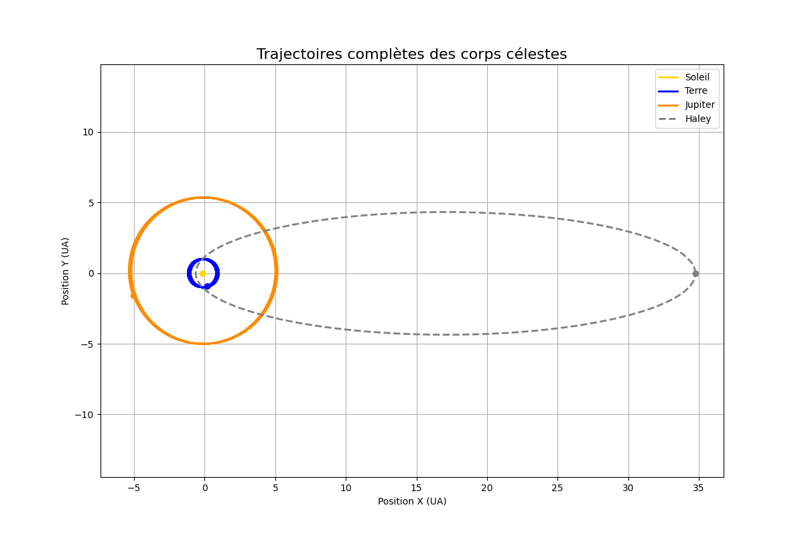

# TP2 - Particules, Collections et et intégrations numériques

## Objectifs

Ce premier TP a pour but de poser les bases d'une simulation particulaire à grande échelle en C++.\
Il introduit : - La création de classes (en particulier `Particule`) - La gestion de collections dynamiques (vecteurs, listes…) - L’analyse de performance avec `chrono` et `gprof` - L’intégration du mouvement via l’algorithme de Störmer-Verlet - La structuration des données et leur encapsulation

------------------------------------------------------------------------

## 1. Structure du projet

-   `/include/particule.hxx` : déclaration de la classe `Particule`
-   `/src/particule.cxx` : définition des méthodes associées
-   `/test/test_perfs_creation.cxx` : comparaison des performances de plusieurs collections
-   `/test/test_planetes.cxx` : implémentation du système gravitationnel proposé
-   `/demo/traceur.py` : permet d'afficher le résultat de la simulation du système gravitationnel composé des 4 planètes
-   `makefile` : compilation du projet

------------------------------------------------------------------------

## 2. Classe `Particule`

Nous avons défini une classe `Particule` caractérisée par : - Une **position** : composée de deux `double`, un `x` et un `y` - Une **vitesse** : composée de deux `doubles` - Une **masse** : `double masse` - Un **identifiant** : `int id` - Une **catégorie** : `std::string type`

### Accès protégé :

Les attributs ont été rendus `private` et manipulés uniquement via des **getters/setters** pour favoriser l'encapsulation.

## 3. Collections de particules

Nous avons expérimenté différentes structures proposées par la STL :

-   `std::vector<Particule>`
-   `std::list<Particule>`
-   `std::deque<Particule>`
-   `std::set<Particule>`

### Objectif :

Comparer leurs performances pour stocker et itérer sur un nombre croissant de particules (de 64 à 2048), afin d'identifier quel conteneur pourrait être le plus performant à l'avenir pour notre simualtaion à grande échelle.

## 4. Analyse de performances

-   **Petites tailles (≤128)** : `deque` et `list` sont les plus rapides devant `set` puis `vector` est le plus lent.
-   **Tailles moyennes à grandes** : `deque` et `list` restent sensiblement équivalent et sont les plus rapides, `vector` devient plus performant et le plus lent est le `set`.

## 5. Mouvement via Störmer-Verlet

Ensuite nous avons mis en place l'algorithme de Störmer-Verlet afin de mettre à jour la position et la vitesse des particules soumises à la force gravitationnelle.

Pour ce faire, à chaque pas de temps nous parcourons le conteneur de particules pour modifier leur position puis leur vitesse. Au vu de l'analyse faite précédement nous avons décidé de stocker les particules dans un `std::vector<Particule>` car le temps d'accès à un élément du `vector` est plus rapide que pour une `list`.

## 6. Sauvegarde et visualisation des résultats

Les positions des corps célestes ont été sauvegardées dans un fichier `.txt`. Afin d'avoir accès au résultats, il faut :

-   exécuter la commande `make all` afin de compiler les différents fichier et générer les éxécutables.
-   Ensuite, après avoir exécuter `exePlanetes`, il faut rediriger la sortie vers un fichier `data.txt`, pour que celui-ci puisse être ouvert à l'aide du fichier Python `traceur.py`. Ce fichier Python va illustrer le mouvement des différentes planètes (voir schéma qui suit).
-   lancer la commande `python3 traceur.py` pour voir s'afficher les schémas.

## 7. Encapsulation

En réponse à la **Question 6**, la classe `Particule` a été mise à jour pour : - Rendre les attributs **privés** - Ajouter des **méthodes d’accès** (get/set) - Éviter toute écriture directe non contrôlée.

## 8. Conclusion

Ce premier TP a permis de poser les bases du projet en C++ en implémentant une première structure de simulation particulaire. À travers la création de la classe Particule, l'utilisation de collections, l'étude de performances, et l'application de l'algorithme de Störmer-Verlet, nous avons acquis une meilleure compréhension de la modélisation physique et des outils fondamentaux du calcul scientifique en C++.
