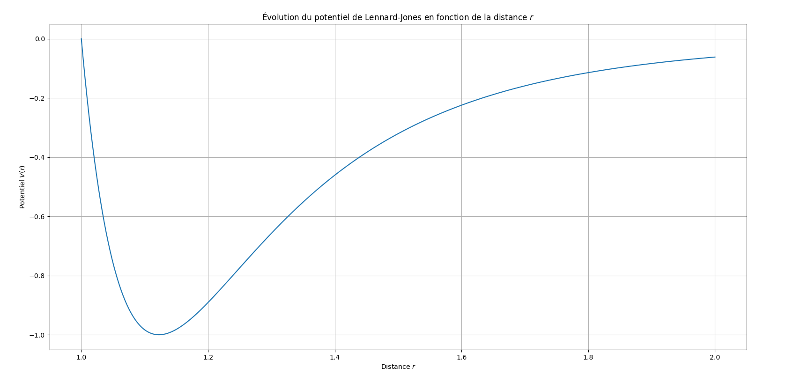
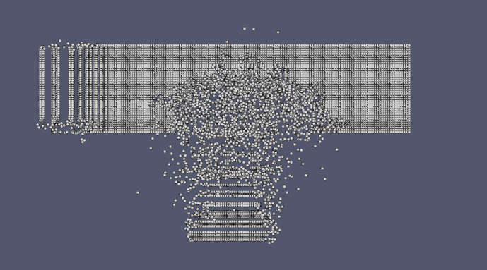
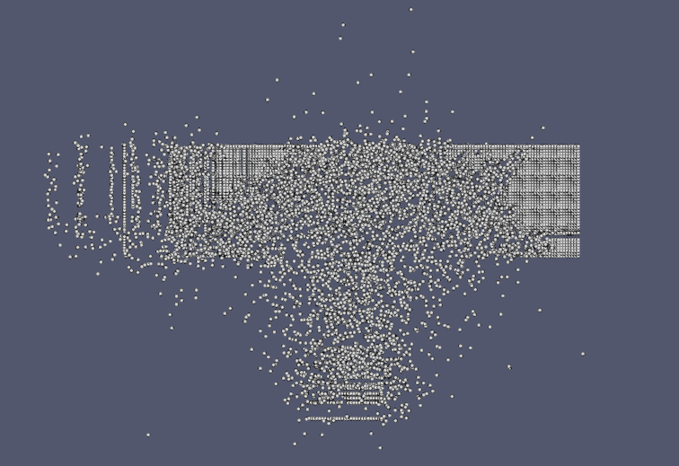

# TP4 - Découpage de l'univers

## Objectifs

Ce TP poursuit l’évolution du simulateur particulaire en C++, avec un accent mis sur : - L’optimisation du calcul des forces entre particules - L’utilisation du **potentiel de Lennard-Jones** - La mise en place d’un **maillage spatial** pour limiter la complexité - La gestion d’un univers organisé en **cellules et voisinages** - Une première **application physique** : collision entre deux blocs de particules

## 1. Création de l’univers

Nous avons conçu une nouvelle classe `Univers`, qui représente : - Les **dimensions** de l’univers (1D, 2D ou 3D) - Le **nombre total de particules** dans celui-ci - Les **limites spatiales** avec un vecteur `ld` - Un **rayon de coupure** (`rcut`) à partir duquel l’interaction est négligée - Un **nombre de cellules** dans chaque direction de l'espace : `nc` - Un **conteneur de particules** afin de stocker toutes les particules de l'univers (dans un `std::vector`) - Un dictionnaire dont la clef est

L’espace est découpé en **cellules** de taille `rcut`, organisées en grille tensorielle : - Chaque cellule connaît ses **voisines** - Chaque particule appartient à une cellule

Cette structure permet de restreindre les calculs d’interaction à des cellules proches.

## QUESTION 1

## QUESTION 2

La classe univers a été créée sur la base de la classe du TP précédent. Elle a été modifiée de sorte à prendre en compte les contraintes. On a donc ajouté les attributs `rcut` (double), `Ld` (Vecteur, taille caractéristique de l'univers dans chaque direction). Nous avons adapté le constructeur et les méthodes en conséquence.

## QUESTION 3

Nous avons donc créé une classe Cellule qui contient comme attribut la position de son centre (`Vecteur`), la taille de la cellule (`Vecteur`) et un vecteur d'indices (utile seulement pour la visualisation).

De même que pour la classe `Univers` il n'y a pas besoin de créer un constructeur par recopie car les attributs ne sont pas dynamiques.

## 🗂️ Structures de données utilisées pour la gestion des particules

Afin d'améliorer les performances du calcul des interactions (notamment pour un potentiel à portée finie comme celui de Lennard-Jones), deux structures de données sont utilisées :

------------------------------------------------------------------------

### 1. `std::vector<Particule> particules`

Ce vecteur contient **l’ensemble des particules** du système. Il est utilisé pour :

-   conserver un accès direct à toutes les particules,
-   parcourir la totalité du système (ex. pour affichage ou export),
-   maintenir une structure linéaire simple.

------------------------------------------------------------------------

### 2. `std::unordered_map<int, std::pair<Cellule, std::unordered_map<int, Particule>>> cellules`

Cette structure sert à organiser les particules dans l’espace en les associant à des **cellules spatiales**.

#### Détail des éléments

-   `int` (clé principale) : identifiant unique de la cellule (généralement calculé à partir de sa position 3D).
-   `Cellule` : objet représentant une région de l’espace, avec :
    -   `position` : vecteur position du coin inférieur (ou centre) de la cellule,
    -   `taille` : dimensions de la cellule,
    -   `indices` : sommets (ou autres points d’intérêt) de la cellule.
-   `std::unordered_map<int, Particule>` : dictionnaire des particules **présentes dans cette cellule**, associées à un identifiant unique.

#### Remarque importante

👉 La classe `Cellule` **ne contient pas directement les particules**, elle ne décrit que la **géométrie de la cellule**.\
Les particules sont associées **dans le `unordered_map` secondaire**, en dehors de la classe.

------------------------------------------------------------------------

### Intérêt de cette structure

-   **Localisation rapide** des particules dans l’espace.
-   **Filtrage spatial** : seules les particules dans une cellule et ses voisines sont prises en compte pour les interactions.
-   Permet de **réduire la complexité** du calcul des forces, notamment dans les grands systèmes.

------------------------------------------------------------------------

### QUESTION 4

Nous modifions le calcul de forces pour itérer seulement sur les particules situées dans les cellules voisines d'une particules. Pour cela, nous crééons des méthodes qui permettent de récupérer les cellules voisines d'une particules, nous itérons ensuite sur les particules contenues dans ces cellules lors du calcul de forces (grâce à la structure de données `cellules`). Nous faisons aussi attentions à mettre à jour les particules situées dans les cellules à chaque itération, et à supprimer les cellules si celles-ci ne contiennent plus de particules, ou à en créer si des particules se trouvent dans la zone d'une nouvelle cellule.

### QUESTION 5

Comme dit à la question 4, nous avons implémenté la fonction de mise à jour des cellules qui regarde pour chaque particule sa nouvelle position, et met à jour la structure de données `cellule` en conséquence.

### QUESTION 6

Nous avons réalisé la simulation avec les données du problème. Cependant, nous avons dû modifier le vecteur `Ld` pour tenir compte des contraintes géométriques (les particules ne pouvaient pas rentrer dans l'univers avec les paramètres fournies).

L'analyse de notre simulation est décrite dans le rapport global (PDF).

