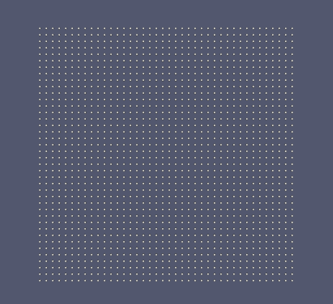

# Simulation de particules en C++ — TP 6

Projet réalisé dans le cadre du module **MMIS C++ pour les mathématiques appliquées** à Grenoble INP.

### QUESTION 1

Nous avons implémenté chacune de ces conditions aux limites en ajoutant un attribut `LIMITE` qui est un `enum`. Pour chaque condition aux limites, nous avons rajouté des conditions, généralement à l'aide de fonctions lambdas qui nous ont permis de simplifier l'implémentation.

Par exemple, pour la condition d'absorption, nous avons modifié la méthode `stormer_verlet` pour supprimer dynamiquement les particules qui dépassent du bord de l'univers.

### QUESTION 2

Nous avons fait un test pour chaque condition aux limites, ces tests se sont avérés concluants.

### QUESTION 3

Ce potentiel a été implémenté en modifiant la méthode de calcul des forces en prenant en compte une force reflexive par bord.

### QUESTION 4

Le test de la condition aux limites réflexives n'a pas été concluant. Nous avons donc pas pu comparer les résultats pour les deux implémentations.

### QUESTION 5

Pour l'ajout du champ gravitationnel, nous avons ajouté un attribut `gravité` pour savoir si l'univers prend en compte le champ gravitationnel ou non. Si c'est le cas. La force gravitationnelle est ajoutée pour chaque particule.

### Compilation

Pour compiler, veuillez suivre les instructions suivantes depuis la racine du tp. mkdir build cd build cmake .. make ./test/\*

Il y a plusieurs éxecutables qui se formeront:

-   test_abs teste la condition aux limites d'absorption.
-   test_period teste la condition aux limites de périodicité.
-   test_reflex teste la condition aux limites de réflexion.
-   test_reflex_pot teste la condition aux limites de réflexion avec potentiel.

### ANNEXE

